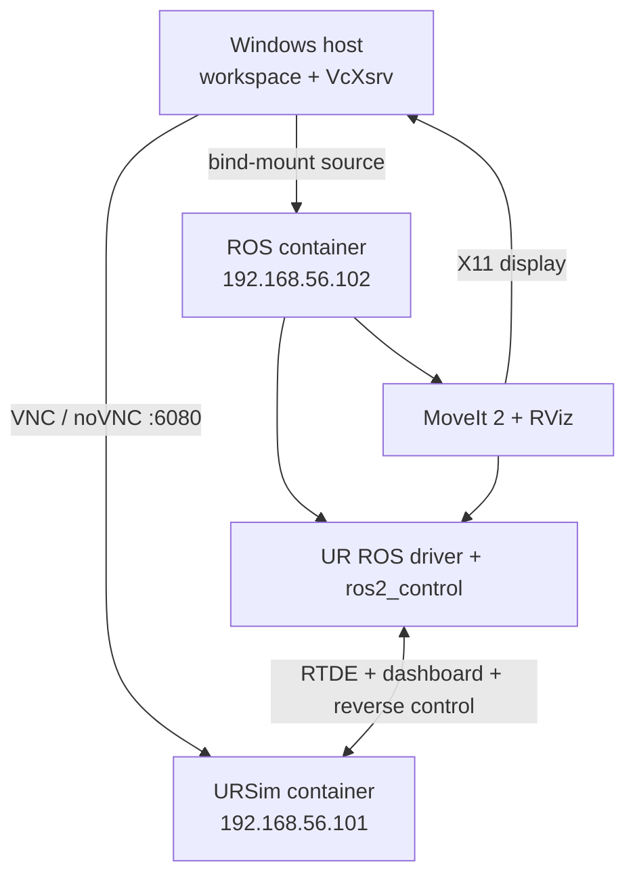

# UR5 Motion-Planning Lab: URSim, ROS 2 Humble, MoveIt 2, and RViz

This is the reproducible setup for the motion-planning lab developed in this
project. It runs the **real Universal Robots ROS 2 driver** against URSim, not
MoveIt's fake hardware. Planning and execution follow the same main software
path used for a networked robot:

`MoveIt 2 -> ros2_control -> UR ROS 2 Driver -> URSim`

The lab workspace remains editable on Windows; Docker supplies the ROS and
URSim environments. The setup has deliberately been reduced to two containers
on one private Docker network, which avoids the unreliable reverse connection
seen when ROS runs in WSL and URSim runs in Docker Desktop.

> **Safety note:** URSim is safe for learning, but a real robot is not. Do not
> use this document as a substitute for risk assessment, an emergency-stop
> procedure, speed/force limits, or a clear physical workcell.

## 1. Architecture



### Containers and responsibilities

| Component | Address / access | Responsibility |
| --- | --- | --- |
| `ursim` | `192.168.56.101`; GUI: `http://localhost:6080/vnc.html` | Simulated UR5 controller and robot arm |
| `ur_ros` | `192.168.56.102` on the same private Docker network | UR driver, `ros2_control`, MoveIt, RViz, and the experiment package |
| Windows host | Docker Desktop and VcXsrv | Stores/edit source, displays URSim and RViz |

The fixed container addresses are internal to Docker. They are intentionally
not Windows, WSL, or public-network addresses.

## 2. What is running inside the ROS container?

`start_ros_stack.sh` performs the following sequence automatically:

1. Sources `/opt/ros/humble/setup.bash`.
2. Builds `ur5e_motion_planning_lab` into `build_docker/` and
   `install_docker/`.
3. Starts `ur_robot_driver` with:
   - `ur_type:=ur5`
   - `robot_ip:=192.168.56.101`
   - `reverse_ip:=192.168.56.102`
   - `headless_mode:=true`
   - `initial_joint_controller:=scaled_joint_trajectory_controller`
4. Waits for `ros2_control` and joint states to start.
5. Starts the vendor `ur_moveit_config` launch with `launch_rviz:=true`.

This uses the vendor launch files directly. The earlier custom WSL launch file
(`ur5_ursim_moveit.launch.py`) is **not** the process used by this Compose
setup.

## 3. One-time Windows setup

### Required software

- Docker Desktop using Linux containers.
- The copied workspace at `D:\GitHub\ur5_moveit\ur5e_moveit_ws`.
- The Docker files at `D:\GitHub\ur5_moveit\ur5e_ros_docker`.
- An X server for RViz. VcXsrv is a simple option on Windows.

### Start VcXsrv for RViz

Before starting Compose, open **XLaunch** and select:

1. **Multiple windows**
2. Display number **0**
3. **Start no client**
4. Check **Disable access control**
5. Finish and allow the Windows Firewall prompt on private networks.

The Compose service sets:

```yaml
DISPLAY: host.docker.internal:0.0
QT_X11_NO_MITSHM: "1"
LIBGL_ALWAYS_SOFTWARE: "1"
```

Therefore the `ur_moveit.launch.py` process can open RViz on the Windows
desktop automatically. Do not set `DISPLAY` manually inside the shell unless
you are troubleshooting a different X server.

### Confirm the URSim image

This guide assumes an **e-Series** URSim image, which supports Remote Control
mode. Check the `ursim.image` value in `docker-compose.yml`. If it still says
`universalrobots/ursim_cb3:latest`, use the e-Series image for this workflow:

```yaml
image: universalrobots/ursim_e-series:latest
```

Keep `ROBOT_MODEL: UR5` for this lab. That is a simulated UR5 model; it is not
the same setting as a physical UR5e.

## 4. Start the full stack

Open Windows PowerShell:

```powershell
cd D:\GitHub\ur5_moveit\ur5e_ros_docker
docker compose up --build -d
docker compose ps
docker compose logs -f ros
```

The first build can take several minutes. Later starts reuse the image and
usually rebuild only the mounted lab package.

Expected services:

```text
ursim    ... healthy
ur_ros   ... running
```

Open URSim in a browser:

```text
http://localhost:6080/vnc.html
```

RViz should also appear on the Windows desktop after the MoveIt launch starts.
If it does not, first confirm that VcXsrv is running, then inspect:

```powershell
docker compose logs --tail=150 ros
```

## 5. Prepare URSim for headless control

The ROS driver uses `headless_mode:=true`. In this mode it sends the control
program to the controller itself; you do **not** need to install an External
Control URCap or click Play on an External Control program.

In the URSim PolyScope UI:

1. Turn the virtual robot **On** and release the brakes if required.
2. Switch the robot to **Remote Control** mode.
3. Leave URSim running.

If ROS was already started while the controller was not ready, restart only
the ROS service after completing the above steps:

```powershell
docker compose restart ros
docker compose logs -f ros
```

The key successful driver message is:

```text
Robot connected to reverse interface. Ready to receive control commands.
```

The `scaled_joint_trajectory_controller` should become active. The driver
uses it to account for the UR controller's speed-scaling state.

## 6. Verify ROS, controllers, planning, and execution

Enter the ROS container:

```powershell
docker compose exec ros bash
```

In that shell:

```bash
source /opt/ros/humble/setup.bash
source /ws/install_docker/setup.bash

ros2 control list_controllers
ros2 topic echo /joint_states --once
```

Look for these controller states:

```text
joint_state_broadcaster              active
scaled_joint_trajectory_controller  active
```

Now run the first experiment:

```bash
ros2 run ur5e_motion_planning_lab ex1_joint_goal
```

Expected result:

```text
[INFO] [ex1_joint_goal]: Sending joint goal: {...}
[INFO] [ex1_joint_goal]: Planning and execution succeeded.
```

The URSim arm should move. RViz will show the robot state from `/joint_states`
and the planned/executed result. A brief `A message was lost` message from a
one-shot `ros2 topic echo` is normally not a control failure.

## 7. Experiments in the lab package

The package has been adapted for ROS 2 Humble without depending on
`moveit_py`. Its scripts use normal MoveIt actions/services instead.

| Script | Main concept |
| --- | --- |
| `ex1_joint_goal` | Joint-space goal, plan, and execute |
| `ex2_pose_goal` | End-effector pose goal / inverse kinematics + OMPL |
| `ex3_cartesian_path` | Cartesian waypoint path |
| `ex4_collision_objects` | Planning-scene collision objects and avoidance |
| `ex5_planner_comparison` | Compare OMPL planner configurations |
| `ex6_pilz_linear` | Industrial Pilz PTP/LIN motions; needs Pilz config loaded |
| `ex7_orientation_constraints` | Path orientation constraints |
| `ex8_attach_detach_object` | Pick/carry/place collision-scene semantics |

Run any one from the sourced `ur_ros` shell, for example:

```bash
ros2 run ur5e_motion_planning_lab ex2_pose_goal
ros2 run ur5e_motion_planning_lab ex4_collision_objects
```

The standard vendor MoveIt launch in this Compose stack provides the normal
OMPL pipeline. Pilz is a separate industrial planner plugin; `ex6_pilz_linear`
requires the earlier Pilz-enabled MoveIt configuration/launch to be added and
loaded. A Pilz rejection is a configuration issue, not evidence that the
motion request itself is invalid.

## 8. How planning and execution communicate

### Software path

1. A lab script sends a `MoveGroup` planning request, or a planning-scene or
   Cartesian-path request, to `move_group`.
2. MoveIt checks robot limits, kinematics, collisions, constraints, and a
   selected planner.
3. MoveIt sends the resulting trajectory to the configured
   `scaled_joint_trajectory_controller`.
4. `ros2_control` passes joint commands through the real UR hardware
   interface in `ur_robot_driver`.
5. The UR driver commands URSim and receives feedback; joint states return to
   RViz and MoveIt.

### UR interfaces: RTDE is not the whole control path

| Interface | Role in this setup |
| --- | --- |
| Dashboard server (`29999`) | Robot mode, power, brake, and program management |
| RTDE (`30004`) | Fast robot state, speed scaling, I/O, and feedback exchange |
| Reverse interface (`50001` by default) | URSim calls back to the ROS driver and receives streaming motion commands |
| Script command / trajectory interfaces | UR driver script and trajectory support, used by specific driver controllers |

So the short answer is: the driver does use **RTDE**, but MoveIt does not send
its trajectory directly as an RTDE trajectory. The driver combines RTDE state
feedback with the reverse control interface that carries commands to the
robot-side URScript program.

### Why the private two-container network matters

The UR control loop runs at a high rate (commonly 500 Hz). In the original
WSL-to-Docker arrangement, the reverse socket crossed several network layers
and URSim timed out waiting for commands. Here both endpoints use fixed
addresses on `ur_lab_net`; the ROS service also receives `SYS_NICE` and real-
time limits for the driver's scheduling request. This is why the reverse
interface remains connected in the working setup.

## 9. Motion-planning concepts covered

This lab already covers a substantial practical base:

- joint-space planning and execution;
- pose/IK goals;
- Cartesian waypoint generation;
- collision objects and attached objects;
- collision checking, self-collision, and allowed-collision semantics;
- orientation/path constraints;
- controller execution through `ros2_control`;
- OMPL sampling-based planning and planner comparison;
- Pilz-style industrial PTP/LIN planning once the Pilz pipeline is loaded;
- simulator-to-driver network integration, feedback, and speed scaling.

### OMPL, RRT/RRTConnect, and Pilz

| Item | What it is | Typical use |
| --- | --- | --- |
| OMPL | A library/pipeline containing many motion planners | General collision-free planning |
| RRT / RRTConnect | Individual sampling-based algorithms available through OMPL | Complex free-space paths; RRTConnect is a common fast default |
| Pilz Industrial Motion Planner | A deterministic industrial planner plugin | Predictable PTP, LIN, and circular motions in controlled workcells |

All valid planners must respect the planning scene. Obstacle avoidance is not
exclusive to RRT or RRTConnect: Pilz plans are also collision checked. The key
difference is that OMPL searches for a feasible route through complex space,
while Pilz aims for predictable industrial motion primitives and may fail when
such a primitive cannot satisfy the scene and constraints.

## 10. Collision avoidance in simulation and on a real cell

MoveIt plans against its **planning scene**. In this lab it knows the robot's
collision meshes, self-collision matrix, joint limits, and any collision
objects added by the scripts. URSim itself does not automatically make every
visual thing in the simulator a MoveIt obstacle.

For a real workcell, the same planners can still be used. The difference is
how the planning scene gets world geometry:

- fixed fixtures/cells: CAD meshes or simple primitives added once;
- known product locations: a perception or PLC/application update adds the
  object pose;
- unknown/dynamic obstacles: depth camera/lidar data is converted to an
  occupancy map (often OctoMap) and updated continuously;
- safety: a certified external safety system still protects people and the
  cell. Planning-scene collision avoidance is not a safety-rated protective
  system.

## 11. External Control URCap versus headless mode

The **External Control URCap** is a PolyScope plugin. It provides a pendant
program node that connects the robot back to the ROS driver and asks it for
the URScript control program.

There are two valid operating modes:

| Mode | External Control URCap/program | How motion program starts |
| --- | --- | --- |
| Pendant mode (`headless_mode:=false`) | Required | Operator loads/runs the program, or dashboard services do so |
| Headless mode (`headless_mode:=true`) | Not required | The ROS driver sends the program directly after the controller is in Remote Control |

The current Compose lab uses **headless mode**. That is why the successful
working setup did not need URCap file-copying or a manually played program.
The URCap remains valuable for a pendant-controlled development workflow and
is often preferable for the first tests on a physical robot.

## 12. Use with the fake-hardware launch

Fake hardware is still useful for rapid script development when URSim is not
needed:

```bash
source /opt/ros/humble/setup.bash
source ~/ur5e_moveit_ws/install/setup.bash
ros2 launch ur5e_motion_planning_lab ur5e_fake_moveit.launch.py
```

In a second terminal:

```bash
source /opt/ros/humble/setup.bash
source ~/ur5e_moveit_ws/install/setup.bash
ros2 run ur5e_motion_planning_lab ex1_joint_goal
```

With fake hardware, the controller is simulated and no physical/URSim robot
is commanded. The code-level planning concept is the same, but network,
calibration, and hardware-controller behaviour are not being tested.

## 13. Move from URSim to a physical UR robot

Your experiment scripts do **not** need to change merely because the target
becomes a real robot. However, it is not safe or sufficient to only replace
the IP address in the current two-container Compose file.

For a physical robot, change the deployment and configuration deliberately:

1. Set `ur_type` to the actual model, for example `ur5e` for an e-Series UR5e.
2. Set `robot_ip` to the robot controller's reachable wired-network IP.
3. Set `reverse_ip` to the ROS computer/container address reachable **from
   the robot**. It must not be `127.0.0.1`.
4. Load the robot's calibration generated with `ur_calibration`; do not use
   URSim's generic calibration for real accuracy.
5. Configure the real tool/TCP, payload, fixtures, joint limits, and collision
   geometry.
6. Verify that `scaled_joint_trajectory_controller` is active.
7. For first physical tests, prefer pendant mode with an installed External
   Control URCap and an operator at the safety controls. Use headless mode
   only after your cell and operating procedure are validated.
8. Start at low speed, establish a clear workspace, and keep the emergency
   stop accessible.

A typical physical-robot driver startup is conceptually:

```bash
ros2 launch ur_robot_driver ur_control.launch.py \
  ur_type:=ur5e \
  robot_ip:=<ROBOT_CONTROLLER_IP> \
  reverse_ip:=<ROS_HOST_REACHABLE_IP> \
  headless_mode:=false \
  launch_rviz:=false \
  initial_joint_controller:=scaled_joint_trajectory_controller
```

Then start the matching `ur_moveit_config` launch. Exact argument names vary
between Humble point releases, so check the installed driver before changing a
real system:

```bash
ros2 launch ur_robot_driver ur_control.launch.py --show-args
ros2 launch ur_moveit_config ur_moveit.launch.py --show-args
```

## 14. Everyday operations and troubleshooting

### Useful Docker commands

```powershell
# Start or rebuild the stack
docker compose up --build -d

# Follow ROS logs
docker compose logs -f ros

# Enter the ROS environment
docker compose exec ros bash

# Stop containers while retaining the URSim program volume
docker compose down

# Remove containers and the persistent URSim program volume (destructive)
docker compose down -v
```

### Common symptoms

| Symptom | What to check |
| --- | --- |
| No `Robot connected to reverse interface...` line | URSim must be powered on and in Remote Control; then `docker compose restart ros`. |
| URSim program/reverse socket stops quickly | Check `ur_ros` logs and controller state. The high-rate reverse connection should stay inside `ur_lab_net`; do not route it through WSL/host loopback. |
| Controller is inactive | Run `ros2 control list_controllers`; the required controller is `scaled_joint_trajectory_controller`. |
| Planning succeeds but robot does not move | Verify controller activation, URSim Remote Control, and the reverse-interface success message. |
| RViz does not appear | Start VcXsrv first; confirm the Compose `DISPLAY` variables and check `docker compose logs ros`. |
| `AMENT_TRACE_SETUP_FILES: unbound variable` | Do not add `set -u` to the startup script; Humble setup scripts read optional unset variables. |
| `moveit_core/local_setup.bash` not found in old WSL workspace | Rebuild/source the correct overlay. In Docker use `/ws/install_docker/setup.bash`, not an old `install/setup.bash`. |
| Pilz planner rejected | Load the Pilz pipeline, plugin, and Cartesian limits; the standard Docker MoveIt launch is OMPL-first. |

## 15. Further reading

- [Universal Robots ROS 2 Driver startup documentation](https://docs.universal-robots.com/Universal_Robots_ROS2_Documentation/doc/ur_robot_driver/ur_robot_driver/doc/usage/startup.html)
- [UR client library URSim Docker setup](https://docs.universal-robots.com/Universal_Robots_ROS2_Documentation/doc/ur_client_library/doc/setup/ursim_docker.html)
- [UR driver operation modes](https://github.com/UniversalRobots/Universal_Robots_ROS2_Driver/blob/main/ur_robot_driver/doc/operation_modes.rst)
- [MoveIt 2 motion-planning concepts](https://moveit.picknik.ai/main/doc/concepts/concepts.html)

---

The working proof point for this lab is: `ex1_joint_goal` reports planning and
execution success, the scaled controller is active, the arm moves in URSim,
and RViz launches from Compose onto the Windows desktop.
